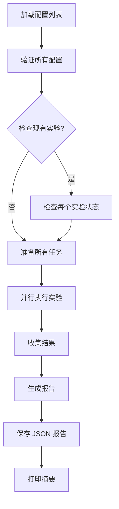

# Task Controller Quick Start Guide

## 📋 Summary

**Task Controller** 是一个批量实验执行工具，可以：
- ✅ 并行运行多个 YAML 实验配置
- ✅ 自动检查已完成的实验并跳过
- ✅ 跟踪每个任务的成功/失败状态
- ✅ 生成详细的执行报告（JSON 格式）
- ✅ 支持全局覆盖实验参数（如 repetitions）

## 🚀 快速使用

### 基本用法

```bash
# 1. 运行指定的实验配置文件
python3 new/task_controller.py \
  --configs configs/robustness/01_01_spsb_ipv_gpt5mini.yaml \
            configs/robustness/01_01_spsb_ipv_llama.yaml \
  --max-workers 2

# 2. 使用通配符运行多个实验
python3 new/task_controller.py \
  --configs "configs/robustness/01_*.yaml" \
  --max-workers 4

# 3. 从配置文件列表运行
python3 new/task_controller.py \
  --config-list new/example_experiments.txt \
  --max-workers 4
```

## 📝 主要参数

### 必需参数（二选一）

| 参数 | 说明 | 示例 |
|------|------|------|
| `--configs` | YAML 配置文件路径列表（支持通配符） | `--configs "configs/*.yaml"` |
| `--config-list` | 包含配置路径的文本文件 | `--config-list experiments.txt` |

### 执行选项

| 参数 | 默认值 | 说明 |
|------|--------|------|
| `--max-workers` | 4 | 最大并行工作线程数 |
| `--repetitions` | - | 覆盖所有实验的 repetitions 设置 |
| `--force-rerun` | False | 强制重新运行已完成的实验 |
| `--no-check-existing` | False | 不检查已存在的实验 |

### 输出选项

| 参数 | 默认值 | 说明 |
|------|--------|------|
| `--report-output` | `batch_report.json` | 批量报告保存路径 |
| `--verbose` | False | 启用详细日志（DEBUG 级别） |

## 📊 输出结构

### 控制台输出示例

```
================================================================================
BATCH EXECUTION REPORT
================================================================================
Total Tasks:      8
✓ Successful:     6
✗ Failed:         1
⊘ Skipped:        1
Duration:         2456.78s (40.95m)
================================================================================

✓ SUCCESSFUL TASKS:
  - spsb_ipv_gpt5mini
    Config: configs/robustness/01_01_spsb_ipv_gpt5mini.yaml
    Output: robustness_logs/V10/spsb_ipv_gpt5mini/run_2026-01-04_15-30-00-123456
    Repetitions: 5/5
    Duration: 324.56s

✗ FAILED TASKS:
  - spsb_apv_llama
    Config: configs/robustness/01_02_spsb_apv_llama.yaml
    Error: Model API timeout after 3 retries

⊘ SKIPPED TASKS:
  - spsb_ipv_gpt4o
    Config: configs/robustness/01_01_spsb_ipv_gpt4o.yaml
    Reason: Already completed (skipped)
```

### JSON 报告格式

```json
{
  "total_tasks": 8,
  "successful_tasks": 6,
  "failed_tasks": 1,
  "skipped_tasks": 1,
  "start_time": "2026-01-04T15:00:00.000000",
  "end_time": "2026-01-04T15:40:56.780000",
  "total_duration_seconds": 2456.78,
  "task_results": [
    {
      "config_path": "configs/robustness/01_01_spsb_ipv_gpt5mini.yaml",
      "experiment_name": "spsb_ipv_gpt5mini",
      "status": "success",
      "output_dir": "robustness_logs/V10/spsb_ipv_gpt5mini",
      "run_dir": "robustness_logs/V10/spsb_ipv_gpt5mini/run_2026-01-04_15-30-00-123456",
      "duration_seconds": 324.56,
      "completed_repetitions": 5,
      "failed_repetitions": 0,
      "total_repetitions": 5
    }
  ]
}
```

## 💡 常见使用场景

### 1. 运行特定拍卖类型的所有 robustness 实验

```bash
python3 new/task_controller.py \
  --configs "configs/robustness/01_01_spsb_ipv_*.yaml" \
  --max-workers 6 \
  --report-output reports/spsb_ipv_robustness.json
```

### 2. 用不同模型并行运行同一实验

```bash
python3 new/task_controller.py \
  --configs configs/robustness/01_01_spsb_ipv_gpt4o_temp01.yaml \
            configs/robustness/01_01_spsb_ipv_gpt4o_temp10.yaml \
            configs/robustness/01_01_spsb_ipv_gpt5mini.yaml \
            configs/robustness/01_01_spsb_ipv_llama.yaml \
  --max-workers 4
```

### 3. 快速测试（减少 repetitions）

```bash
python3 new/task_controller.py \
  --configs "configs/experiments/01_*.yaml" \
  --repetitions 1 \
  --max-workers 8
```

### 4. 重新运行失败的实验

```bash
# 第一步：从报告中提取失败的实验
cat batch_report.json | jq -r '.task_results[] | select(.status=="failed") | .config_path' > failed_experiments.txt

# 第二步：重新运行失败的实验
python3 new/task_controller.py \
  --config-list failed_experiments.txt \
  --force-rerun
```

### 5. 运行所有实验并自动跳过已完成的

```bash
# 首次运行
python3 new/task_controller.py \
  --configs "configs/robustness/*.yaml" \
  --max-workers 4

# 如果中断，再次运行相同命令会自动跳过已完成的实验
python3 new/task_controller.py \
  --configs "configs/robustness/*.yaml" \
  --max-workers 4
```

## 🔍 智能完成检测

Task Controller 会自动检查实验是否已完成：

1. **检查 output_dir**：查找配置中指定的输出目录
2. **查找最近的 run**：找到最新的 `run_*` 目录
3. **读取 summary**：读取 `experiment_summary.json`
4. **比较 repetitions**：检查 `completed_runs` 是否等于 `total_runs`
5. **跳过已完成的**：如果完全成功则跳过，否则重新运行

禁用此功能的方法：
- 使用 `--force-rerun`：强制重新运行所有实验
- 使用 `--no-check-existing`：不检查现有实验

## 📁 输出文件结构

```
experiment_logs/V10/
└── {experiment_name}/
    ├── experiments_index.json        # 实验索引（所有 runs）
    └── run_2026-01-04_15-30-00-123456/
        ├── config.yaml               # 配置快照
        ├── experiment_summary.json   # 执行摘要
        ├── raw_data/                 # 原始 LLM 输出
        │   ├── raw_output__run0.jsonl
        │   └── result_0_*.json
        ├── results/                  # CSV 结果
        │   └── results.csv
        └── prompts/                  # 使用的 prompt 文件
            ├── instruction.txt
            ├── persona.txt
            └── ...

batch_report.json                     # 批量执行报告
```

## ⚙️ 工作原理



## 🔧 故障排查

### 所有任务都被跳过

**原因**：检测到已完成的实验

**解决**：
```bash
# 方法1：强制重新运行
python3 new/task_controller.py --configs "*.yaml" --force-rerun

# 方法2：删除旧的输出目录
rm -rf experiment_logs/V10/{experiment_name}/run_*
```

### 任务失败（API 错误）

**原因**：API 速率限制或配额不足

**解决**：
```bash
# 减少并行工作线程
python3 new/task_controller.py --configs "*.yaml" --max-workers 2
```

### 内存不足

**原因**：太多并行任务

**解决**：
```bash
# 减少 max_workers
python3 new/task_controller.py --configs "*.yaml" --max-workers 1
```

## 📖 进阶用法

### 创建配置文件列表

```bash
# experiments.txt
# 主实验
configs/experiments/01_01_spsb_ipv.yaml
configs/experiments/01_02_spsb_apv.yaml
configs/experiments/01_03_fpsb_ipv.yaml

# Robustness 检查
configs/robustness/01_01_spsb_ipv_claude_sonnet.yaml
configs/robustness/01_01_spsb_ipv_gemini.yaml
configs/robustness/01_01_spsb_ipv_gpt5mini.yaml
```

### 使用 jq 分析报告

```bash
# 查看所有成功的实验
cat batch_report.json | jq '.task_results[] | select(.status=="success") | .experiment_name'

# 查看失败实验的错误信息
cat batch_report.json | jq '.task_results[] | select(.status=="failed") | {name: .experiment_name, error: .error_message}'

# 计算总耗时
cat batch_report.json | jq '.task_results[] | .duration_seconds' | awk '{sum+=$1} END {print sum/60 " minutes"}'

# 导出成功实验的 run_dir
cat batch_report.json | jq -r '.task_results[] | select(.status=="success") | .run_dir' > successful_runs.txt
```

### 批量导出结果

```bash
# 导出所有成功实验的结果到 CSV
for run_dir in $(cat batch_report.json | jq -r '.task_results[] | select(.status=="success") | .run_dir'); do
  echo "Exporting: $run_dir"
  python3 export_results.py --run-dir "$run_dir"
done
```

## 🎯 最佳实践

1. **先小规模测试**：用 1-2 个实验测试配置
   ```bash
   python3 new/task_controller.py --configs configs/robustness/01_01_spsb_ipv_gpt5mini.yaml --repetitions 1
   ```

2. **监控资源**：根据机器资源调整 `max_workers`
   - 本地机器：2-4 workers
   - 服务器：4-8 workers
   - 注意 API 速率限制

3. **保存报告**：为不同批次使用不同的报告文件名
   ```bash
   python3 new/task_controller.py --configs "*.yaml" --report-output reports/batch_$(date +%Y%m%d).json
   ```

4. **中断恢复**：如果批量执行中断，重新运行相同命令即可自动跳过已完成的实验

5. **使用 verbose 模式调试**：
   ```bash
   python3 new/task_controller.py --configs "*.yaml" --verbose 2>&1 | tee execution.log
   ```

## 📚 相关文档

- [README_task_controller.md](README_task_controller.md) - 详细文档
- [new/main.py](main.py) - 单个实验编排器
- [src/experiment/config.py](../src/experiment/config.py) - 配置系统

## 🤝 与其他工具集成

### 与 main.py 的关系

Task Controller 内部使用 `ExperimentOrchestrator`（来自 `main.py`），因此：
- ✅ 所有配置选项都兼容
- ✅ 输出结构完全相同
- ✅ 可以使用 `export_results.py` 导出数据

### 典型工作流

```bash
# 1. 批量运行实验
python3 new/task_controller.py \
  --configs "configs/robustness/01_01_*.yaml" \
  --max-workers 4 \
  --report-output reports/robustness_01_01.json

# 2. 检查报告
cat reports/robustness_01_01.json | jq '.successful_tasks'

# 3. 导出所有结果
for run_dir in $(cat reports/robustness_01_01.json | jq -r '.task_results[] | select(.status=="success") | .run_dir'); do
  python3 export_results.py --run-dir "$run_dir"
done

# 4. 合并所有 CSV 结果
python3 scripts/merge_results.py --input "experiment_logs/V10/*/run_*/results/*.csv" --output combined_results.csv
```

## 🎉 总结

Task Controller 提供了一个强大的批量实验执行系统：

- 🚀 **高效**：并行执行多个实验
- 🧠 **智能**：自动跳过已完成的实验
- 📊 **透明**：详细的进度和结果报告
- 🔧 **灵活**：支持各种配置覆盖
- 💪 **健壮**：错误处理和重试机制

开始使用：
```bash
python3 new/task_controller.py --help
```
